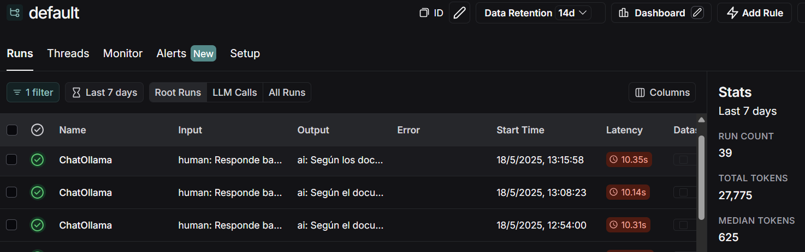
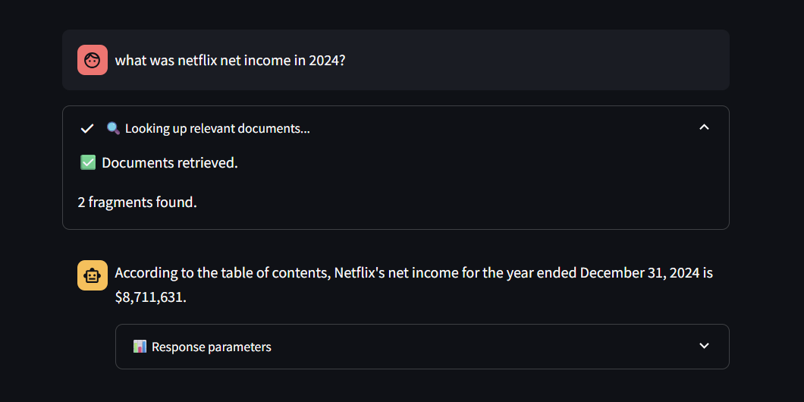

# 🧠 RAG-CHATBOT: PDF Question Answering with Local LLMs

This project implements a **Retrieval-Augmented Generation (RAG)** chatbot using **LangChain**, **ChromaDB**, and **Ollama** with local large language models. It allows users to upload a PDF, extract its content, embed the data, and chat with it in natural language via a Streamlit interface.

---
## 🚀 Getting Started

### 1. Clone the repository

```bash
git clone https://github.com/youruser/rag-chatbot.git
cd rag-chatbot
```

### 2.  Install dependencies

```bash
uv pip install -r requirements.txt
Ollama pull llama3.2:latest
Ollama pull nomic-embed-text
```

### 3.  Set environment variables

Create a `.env` file with:

```bash
LANGSMITH_API_KEY=your_key
LANGSMITH_TRACING="true"
USER_AGENT=rag-bot
```

This will allow you to trace the interactions:




### 4. Run the app

```bash
streamlit run src/app.py
```

---
## 📄 Example Use Case

Ask questions about annual reports:


